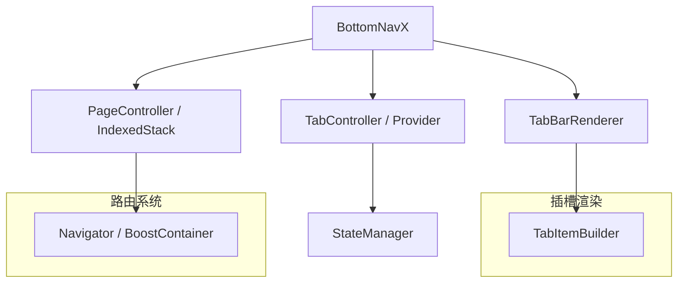

# GEMINI.md - flutter_navx 开发指导

本文档旨在为 `flutter_navx` 组件的开发者提供全面的开发指导，整合了产品设计与技术架构的核心内容。

## 一、项目概述

`bottom_navx` 是一个轻量级、可高度自定义的 Flutter 底部导航组件，旨在替代官方的 `BottomNavigationBar` + `IndexedStack` 方案，提供更灵活的页面管理和状态保持能力。

**设计目标:**

- 提供简洁易用的底部导航功能。
- 支持页面状态保持与懒加载。
- 允许通过 Builder 模式高度自定义 UI 样式与交互。
- 兼容主流路由框架（如 `go_router`, `flutter_boost`）。

## 二、核心特性

- **页面状态保持**: 默认使用 `IndexedStack` 缓存和保持页面状态。
- **高度自定义**: 支持通过 `tabBuilder` 和 `pageBuilder` 自定义导航栏和页面内容。
- **懒加载**: 可配置页面加载策略，优化初始内存占用。
- **嵌套导航**: 支持在每个 Tab 内嵌套独立的 `Navigator`。
- **丰富的视觉效果**: 支持自定义动画、徽标、选中效果等。

## 三、技术架构

`bottom_navx` 的核心架构围绕 `BottomNavX` 组件构建，通过 `TabBarRenderer` 渲染 UI，`PageController` / `IndexedStack` 管理页面，并由 `TabController` / `Provider` 管理状态。



**关键组件说明:**

- **`BottomNavX`**: 组件入口，负责接收配置和控制整体逻辑。
- **`BottomNavController`**: 状态控制器，用于外部控制 Tab 切换。
- **`IndexedStack` / `PageView`**: 页面容器，用于实现页面切换和状态保持。
- **`tabBuilder` / `pageBuilder`**: 自定义渲染器，用于实现 UI 的灵活定制。

## 四、快速上手

以下是一个基础的 `bottom_navx` 使用示例：

```dart
import 'package:flutter/material.dart';
import 'package:bottom_navx/bottom_navx.dart'; // 假设的包名

void main() => runApp(MyApp());

class MyApp extends StatelessWidget {
  @override
  Widget build(BuildContext context) {
    return MaterialApp(
      home: MyHomePage(),
    );
  }
}

class MyHomePage extends StatefulWidget {
  @override
  _MyHomePageState createState() => _MyHomePageState();
}

class _MyHomePageState extends State<MyHomePage> {
  int _currentIndex = 0;

  final List<Widget> _pages = [
    Center(child: Text('首页')),
    Center(child: Text('消息')),
    Center(child: Text('我的')),
  ];

  @override
  Widget build(BuildContext context) {
    return Scaffold(
      appBar: AppBar(title: Text('BottomNavX 示例')),
      body: BottomNavX(
        currentIndex: _currentIndex,
        pageBuilder: (index) => _pages[index],
        items: [
          BottomNavItem(icon: Icon(Icons.home), label: '首页'),
          BottomNavItem(icon: Icon(Icons.message), label: '消息'),
          BottomNavItem(icon: Icon(Icons.person), label: '我的'),
        ],
        onTap: (index) {
          setState(() {
            _currentIndex = index;
          });
        },
      ),
    );
  }
}
```

## 五、API 参考

### `BottomNavX`

| 参数 | 类型 | 说明 |
| --- | --- | --- |
| `items` | `List<BottomNavItem>` | 导航项配置 |
| `currentIndex` | `int` | 当前选中的索引 |
| `pageBuilder` | `Widget Function(int index)?` | 页面构建器 |
| `tabBuilder` | `Widget Function(int, bool)?` | Tab 构建器 |
| `onTap` | `void Function(int index)?` | 点击回调 |

### `BottomNavItem`

| 参数 | 类型 | 说明 |
| --- | --- | --- |
| `icon` | `Icon` | 图标 |
| `label` | `String` | 标签 |
| `badge` | `Widget?` | 徽标 |

## 六、版本规划 (Roadmap)

| 版本 | 主要特性 | 状态 |
| --- | --- | --- |
| v1.0.0 | 基础导航、`IndexedStack` 切换 | ⏳ 待开发 |
| v1.1.0 | 自定义 `tabBuilder` / `pageBuilder` | ⏳ 待开发 |
| v1.2.0 | 嵌套 `Navigator`、懒加载机制 | ⏳ 待开发 |
| v2.0.0 | 与 `flutter_tabx` 联动、混合栈支持 | 🔄 规划中 |

## 七、贡献指南

我们欢迎任何形式的贡献，包括但不限于：

- **报告 Bug**: 通过 [GitHub Issues](https://github.com/your-repo/flutter_navx/issues) 提交问题。
- **提交 PR**: 修复 Bug 或实现新功能。
- **提供建议**: 对产品设计和功能规划提出建议。

**开发流程:**

1.  Fork 本仓库。
2.  创建新的分支 (`git checkout -b feature/your-feature`)。
3.  提交你的代码 (`git commit -m 'Add some feature'`)。
4.  推送到你的分支 (`git push origin feature/your-feature`)。
5.  创建 Pull Request。

---
