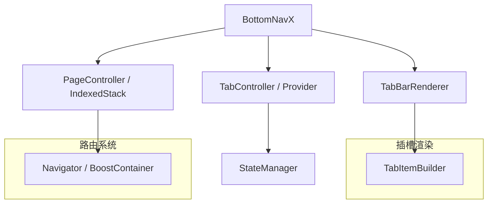

## 🧠 `bottom_navx` 技术架构文档

### 一、技术架构图



---

### 二、模块拆解说明

#### 1. `BottomNavX` 组件入口

* 用于接收 `items` 配置，控制切换逻辑
* 内部集成 `BottomNavigationBar` 或自定义渲染器

#### 2. 页面切换实现方案

* 默认使用 `IndexedStack` 保持每个页面状态
* 也可切换为 `PageView` 实现滑动切换（可配置）

#### 3. 状态管理

* 提供 `BottomNavController`，用于控制选中 tab、触发页面更新
* 支持外部接入状态管理方案（如 Provider、Riverpod）

#### 4. 路由嵌套支持

* 每个 Tab 可包含自己的 `Navigator`
* 若使用 FlutterBoost，可嵌入 `BoostContainer` 来管理混合页面堆栈

#### 5. 插槽渲染能力

* 通过传入构建器如 `tabBuilder`, `pageBuilder` 实现 UI 定制
* 默认支持图文混排、凸起按钮等结构

---

### 三、生命周期管理策略

| 页面状态   | 行为说明                     |
| ------ | ------------------------ |
| 初次加载   | 调用 `pageBuilder` 构建页面并缓存 |
| 切换 Tab | 使用 `IndexedStack` 显示目标页面 |
| 保持状态   | 默认所有页面保活（可配置）            |

---

### 四、关键类设计草图（Dart）

```dart
class BottomNavX extends StatefulWidget {
  final List<BottomNavItem> items;
  final int currentIndex;
  final Widget Function(int index)? pageBuilder;
  final Widget Function(int index, bool selected)? tabBuilder;
  ...
}

class BottomNavItem {
  final Icon icon;
  final String label;
  final Widget? badge;
  final bool selected;
  ...
}
```

---

### 五、平台兼容性策略

| 场景            | 支持说明                  |
| ------------- | --------------------- |
| Android / iOS | ✅ 完全支持                |
| FlutterBoost  | ✅ 可封装为 BoostContainer |
| Web / Desktop | ⛔️ 非重点支持方向（但结构无依赖限制）  |

---

### 六、性能与优化策略

| 点      | 策略                          |
| ------ | --------------------------- |
| 页面预加载  | `IndexedStack` 避免页面重建       |
| 内部状态管理 | 精细更新、避免 rebuild             |
| 懒加载机制  | 支持页面延迟构建                    |
| 页面缓存   | 使用 Map\<int, Widget> 缓存每页内容 |

---

### 七、后续升级计划

| 版本   | 功能                                   |
| ---- | ------------------------------------ |
| v1.0 | 支持基础 BottomNavigation + IndexedStack |
| v1.1 | 支持 tabBuilder/pageBuilder 插槽自定义      |
| v1.2 | 支持嵌套 Navigator，独立导航栈                 |
| v2.0 | 支持 FlutterBoost 混合栈路由接入              |

---